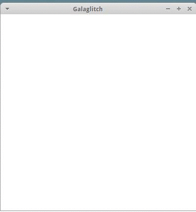
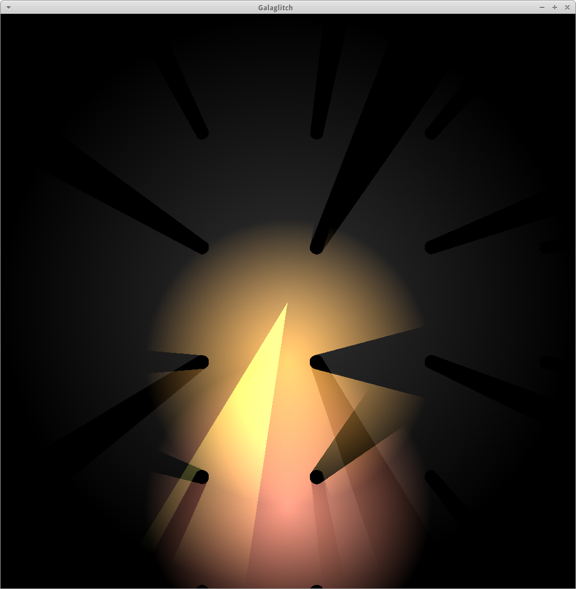
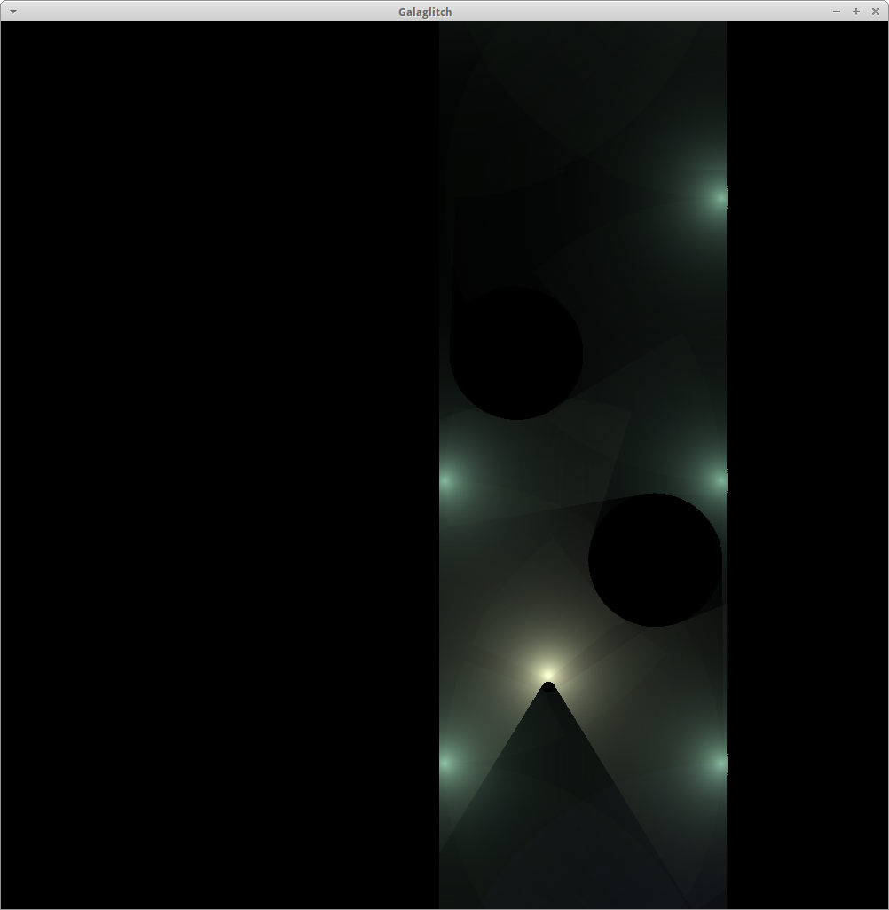

# Galaglitch
A game about driving around the surface of a 3D manifold in 2D rendered using distance fields.

I added dithering to combat some banding artifacts. I could probably improve it a bit more. This uses ordered dithering as explained here [https://en.wikipedia.org/wiki/Ordered_dithering](https://en.wikipedia.org/wiki/Ordered_dithering). Its done in the [s2.frag](resources/s2.frag) fragment shader. It is quite cheap to do and will work on most platforms. An even better solution could be to render to a more precise framebuffer, like GL_RGB16 and then use a better dithering scheme but for now im satisfied with the results. Below is shown before and after dithering (left/right):

I decided to rewrite the distance field tracing in a GPU algorithm. To do this I created a compute shader and copied the code from the c version. This now runs remarkably faster, but the shader used is exactly the same. This is easy as a compute shader allows me to directly write into a vertex buffer. It turns out im no good at coming up with games. This is about being the little circle and taking over the big ones.
